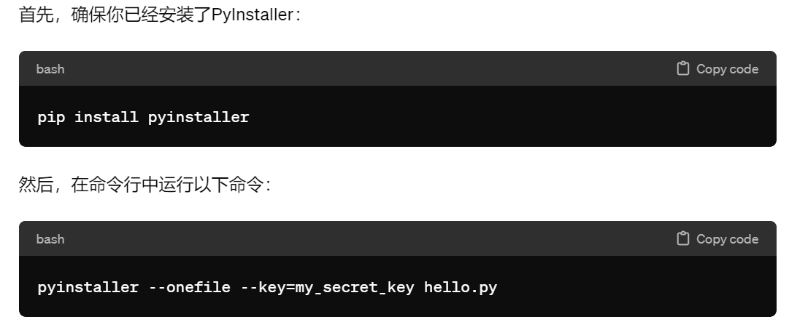
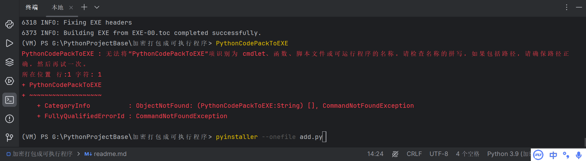

# 使用说明

pip install pyinstaller

# 打包代码

pyinstaller --onefile 示例代码.py

pyinstaller --onefile add.py

# 代码输入位置
终端输入打包代码

# 文件解释
build文件夹：自动生成

dist文件夹：自动生成，EXE文件所在位置

VM文件夹：解释器配置信息

.spec：打包的目录文件，自动生成

# 提交和推送的区别
提交：本地改变
推送：改变推送到服务器中

